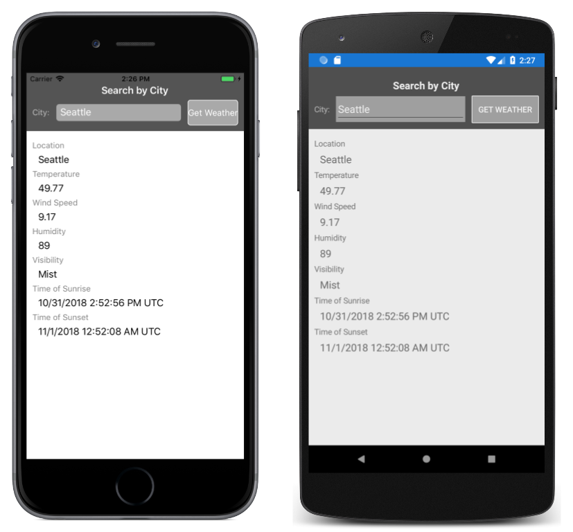

# Weather App

WeatherApp is a sample app that retrieves weather data from OpenWeatherMap.

To use this sample, you must sign up for a free API key at [https://openweathermap.org/appid](https://openweathermap.org/appid). Paste that key into the `Constants.OpenWeatherMapAPIKey` property.

